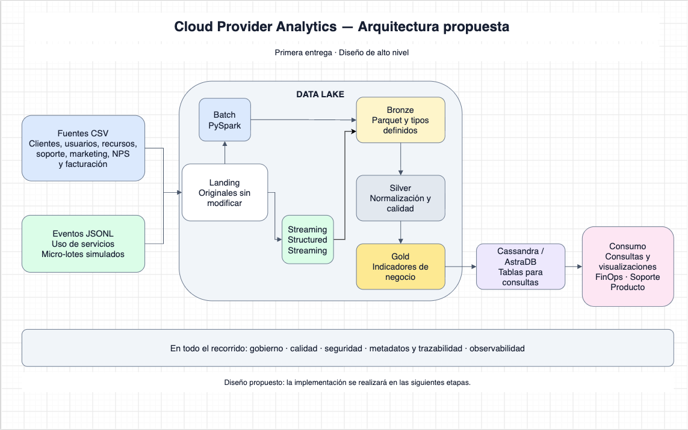

# Cloud Provider Analytics — TPE Big Data

Proyecto integrador de **72.80 Big Data** (ITBA, 2.º cuatrimestre 2026).

**Equipo:** Francisco Varela (64447) · Santiago Manuel Devesa (64223) · _(completar con los demás integrantes)_
**Docente:** Diego Mosquera

| Instancia | Fecha límite |
|---|---|
| Primera evaluación parcial | Lunes 05/10/2026 (prórroga de una semana sobre el 28/09) |
| Segunda evaluación parcial | Lunes 16/11/2026 · 18:30 h |
| Evaluación final (MVP) | Lunes 07/12/2026 · 21:30 h |

## Objetivo

Pipeline ETL + streaming + serving para un proveedor de nube: integra clientes, recursos, facturación, soporte, marketing y eventos de uso para responder preguntas de FinOps, Soporte y Producto. Usa PySpark, Parquet y Cassandra/AstraDB.

## Arquitectura

Patrón híbrido (batch + streaming) sobre un Data Lake de cuatro zonas en Parquet: Landing → Bronze → Silver → Gold, con publicación en Cassandra/AstraDB. El diseño completo está en [`docs/entrega1/diseno.md`](docs/entrega1/diseno.md).



## Estructura del repositorio

```
.
├── README.md
├── DECISIONS.md            decisiones, alternativas y justificaciones
├── docs/                   consigna, informes (entrega1/…) y PDFs generados
├── data/                   datos de muestra / cómo obtenerlos (nunca secretos)
├── datalake/               zonas del Data Lake; landing/ = datos provistos, INMUTABLES
├── src/                    código de ingesta, procesamiento y serving
├── notebooks/              exploración de datos, con salidas guardadas
├── tests/                  pruebas de transformaciones y calidad
├── config/                 configuración externalizada (ejemplos sin credenciales)
├── infra/                  Docker, compose o scripts para ejecutar
├── evidence/               logs, capturas y resultados de cada entrega
└── tools/docs/             herramientas para generar el PDF desde Markdown
```

`datalake/bronze|silver|gold|quarantine/` y los checkpoints se generan al ejecutar el pipeline y no se versionan.

## Requisitos

- Python 3.10+ (dependencias en [`requirements.txt`](requirements.txt))
- A partir de la segunda entrega: Java 11/17 y PySpark, y una cuenta de AstraDB (ver [`config/`](config/))

## Ejecución

Entorno (una vez, desde la raíz):

```bash
python -m venv .venv
source .venv/bin/activate              # Windows PowerShell: .\.venv\Scripts\Activate.ps1
pip install -r requirements.txt
```

Estado actual (primera entrega):

| Qué | Cómo |
|---|---|
| Generar el PDF del informe | `python tools/docs/build_pdf.py` → `docs/build/entrega1.pdf` (detalle en [`tools/docs/README.md`](tools/docs/README.md)) |
| Explorar los datos | `jupyter lab notebooks/` (ver [`notebooks/README.md`](notebooks/README.md)) |

El comando para ejecutar el pipeline completo se agregará con la implementación.

## Pruebas

Se agregarán en `tests/` junto con el código. Hoy no hay código productivo que probar.

## Limitaciones

Primera entrega: diseño y exploración. No hay pipeline implementado todavía; los indicadores y las reglas de calidad descriptos en el informe son propuestas.

## Convenciones

- El informe se escribe en Markdown (`docs/entrega1/diseno.md`); el PDF es un producto del build.
- `datalake/landing/` no se modifica nunca (la consigna lo exige). Git está configurado para no alterar esos archivos.
- Una rama por cambio y revisión de otro integrante antes de mergear. Al entregar: `git tag entregaN`.
- Nunca se versionan credenciales de AstraDB (token, Secure Connect Bundle): usar `.env` (ignorado).
