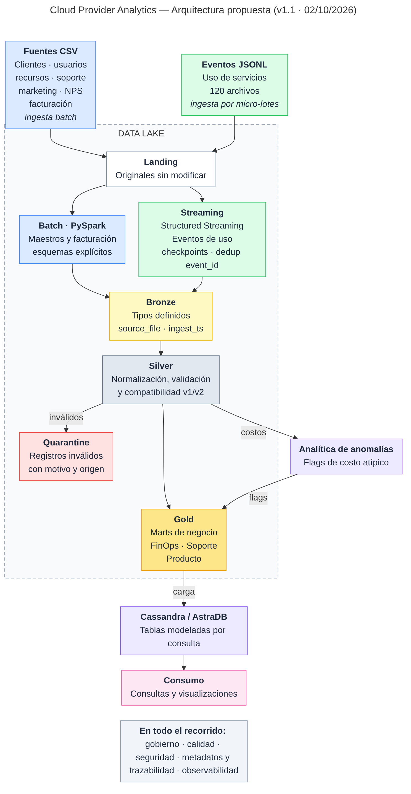

# 72.80 - Big Data

**Primera evaluación parcial**

Fecha de entrega: 05/10/2026

**Alumnos**

| Nombre | Legajo |
|---|---|
| Santiago Manuel Devesa | 64223 |
| Rosario Otegui | 63708 |
| Alicia Cobo Iglesias | 69568 |
| Ernest Elies Domingo | 69613 |
| Francisco Varela | 64447 |

**Profesores**

Diego Mosquera Uzcaregui

<!-- pagebreak -->

## 1. Problema, usuarios y objetivos

### Problema

Siete fuentes CSV (clientes, usuarios, recursos, soporte, marketing, NPS y facturación) y un stream de eventos de uso en JSONL, con estructuras y frecuencias distintas, nulos, tipos ambiguos y un cambio de esquema a mitad del histórico. Hay que integrarlas en un Data Lake y publicar indicadores de costos, uso y soporte. Los eventos de uso necesitan actualización cercana al tiempo real; los maestros y la facturación, procesamiento diario o mensual.

### Usuarios y preguntas

| Usuarios | Preguntas |
|---|---|
| FinOps | ¿Cuál es el costo y la cantidad de requests diarios por organización y servicio? ¿Qué costos son anómalos? ¿Qué servicios acumulan más costo en los últimos 14 días? ¿Cuál es la facturación mensual con créditos, impuestos y conversión a USD? |
| Soporte | ¿Cómo evoluciona la cantidad de tickets críticos? ¿Qué proporción incumple el SLA? ¿Cuál es el CSAT promedio? |
| Producto / Usage | ¿Cómo varía el uso de cada servicio? ¿Cuántos tokens de GenAI se consumen por día y organización, y a qué costo estimado? ¿Qué métricas de carbono hay disponibles? |

### Objetivos y criterios de éxito

| Objetivo | Criterio medible |
|---|---|
| **O1.** Integrar las fuentes | Las ocho fuentes tienen destino y modalidad de ingesta definidos (sección 3) y se cargan en Bronze sin modificar Landing. |
| **O2.** Analizar costos y consumo | Las consultas de costos y requests diarios por organización y servicio, y del top-N de servicios de los últimos 14 días, responden desde Cassandra. |
| **O3.** Seguir soporte | La consulta de tickets críticos y tasa de incumplimiento de SLA de los últimos 30 días responde desde Cassandra; el CSAT se calcula sobre las respuestas disponibles. |
| **O4.** Detectar anomalías de costo | Cada costo atípico queda marcado con un flag o score, se conserva el dato original y el método (z-score robusto o percentiles) está justificado. |
| **O5.** Incorporar métricas de Producto | La consulta de tokens de GenAI y costo estimado por día responde desde Cassandra; la ausencia de `carbon_kg` o `genai_tokens` no se trata como cero. |
| **O6.** Trazabilidad y calidad | Cada registro de Bronze tiene `source_file` e `ingest_ts`; los registros leídos son iguales a los aceptados más los enviados a quarantine, cada uno con su motivo. |
| **O7.** Analizar facturación | La consulta de revenue mensual en USD, con créditos e impuestos, responde desde Cassandra. |

## 2. Justificación de Big Data

El dataset provisto (43.200 eventos, ≈13 MB en 60 días) cabe en una sola máquina: su tamaño no justifica por sí solo un procesamiento distribuido. El diseño apunta a la escala de un proveedor real.

| Dimensión | Aplicación al caso | Decisión de diseño |
|---|---|---|
| **Volumen** | Los eventos crecen con los clientes, los recursos y el tiempo. | Spark y Parquet particionado por fecha. |
| **Velocidad** | Uso y costos requieren actualización cercana al tiempo real; maestros y facturación son diarios o mensuales. | Streaming para eventos, batch para el resto. |
| **Variedad** | CSV y JSONL; la versión 2 de los eventos agrega campos. | Esquema explícito por fuente y esquema común para v1 y v2. |
| **Veracidad** | Nulos, números como texto, costos negativos. | Landing inmutable, reglas de calidad y quarantine. |
| **Valor** | Costos, consumo, facturación, SLA y uso de productos. | Un mart de Gold por pregunta de cada área. |

## 3. Inventario y calidad inicial

Exploración con pandas en `notebooks/01_exploracion_maestros.ipynb` y `notebooks/02_exploracion_eventos.ipynb` (salidas guardadas). No hay claves duplicadas ni referencias huérfanas (`org_id`, `resource_id`) en el dataset provisto.

| Fuente | Filas | Grano y clave | Ingesta |
|---|---:|---|---|
| `customers_orgs.csv` | 80 | Organización; `org_id` | Batch diaria |
| `users.csv` | 800 | Usuario; `user_id` | Batch diaria |
| `resources.csv` | 400 | Recurso; `resource_id` | Batch diaria |
| `support_tickets.csv` | 1.000 | Ticket; `ticket_id` | Batch diaria |
| `marketing_touches.csv` | 1.500 | Interacción; `touch_id` | Batch diaria |
| `nps_surveys.csv` | 92 | Encuesta; `org_id` + `survey_date` | Batch diaria |
| `billing_monthly.csv` | 240 | Factura; `invoice_id` | Batch mensual |
| `usage_events_stream/*.jsonl` | 43.200 | Evento; `event_id` (120 archivos) | Micro-lotes |

### Hallazgos de calidad

| Hallazgo | Tratamiento |
|---|---|
| 11 organizaciones sin `nps_score`; 19 encuestas sin `nps_score` y 10 sin `comment` | Calcular sobre las puntuaciones disponibles e informar la cobertura |
| 139 usuarios sin `last_login`; 232 con `last_login` anterior a `created_at` | Conservar la ausencia; validar la coherencia de fechas |
| 83 recursos sin `tags_json` | Conservar la ausencia |
| 240 tickets sin `resolved_at`, 254 sin `csat`; 172 con `csat` sin `resolved_at` | Distinguir abiertos de errores; CSAT sobre las respuestas disponibles |
| `csat` entre 0 y 7; `nps_score` negativos | Abierta (sección 10) |
| 137 facturas sin `credits`; 13 subtotales negativos | Abierta (sección 10) |
| Tipo de cambio distinto de 1 en 160 facturas en USD; importes en ARS de magnitud similar a USD | Abierta (sección 10) |
| 877 eventos sin `value`; 2.075 sin `unit`, de los cuales 2.038 tienen `value` | Validar según la métrica; flag o quarantine |
| 216 eventos con costo negativo (211 menores a −0,01) | Flag; abierta (sección 10) |
| 1.309 `value` como texto, todos convertibles | Cast con valor de respaldo en Bronze |
| 7.371 eventos anteriores a la creación de su recurso | Abierta (sección 10) |
| Cada archivo del stream abarca ≈60 días; el orden de llegada no es temporal | Upsert idempotente; el watermark no sirve para descartar datos |
| 10.800 eventos v1 y 32.400 v2; `carbon_kg` (32.400 eventos) y `genai_tokens` (3.132) solo en v2 | Esquema común con campos opcionales; ausencia no equivale a cero |

## 4. Arquitectura de alto nivel

Dos caminos de entrada, batch (PySpark, para los CSV) y streaming (Structured Streaming, para los JSONL), escriben en las zonas del Data Lake. Los registros que no pasan la validación de Silver van a quarantine. Gold se carga en Cassandra/AstraDB para su consulta. Las responsabilidades de cada componente están en la sección 6.

<!-- pagebreak -->

{height=23cm}

*Fuente editable en texto: [`diagramas/arquitectura-v1.1.mmd`](diagramas/arquitectura-v1.1.mmd) (Mermaid).*

<!-- pagebreak -->

## 5. Patrón arquitectónico

Híbrido: batch para maestros y facturación (ciclo diario o mensual) y streaming para los eventos de uso (actualización cercana al tiempo real). Kappa obligaría a modelar maestros y facturación como streams; una Lambda clásica mantendría dos implementaciones de la misma agregación sobre los eventos. El híbrido usa una sola ruta por fuente y comparte zonas y Gold.

## 6. Mapeo de requisitos a componentes

| Componente | Responsabilidad | Objetivos | 5V |
|---|---|---|---|
| PySpark batch | Leer los CSV con esquema explícito y escribir Bronze | O1, O3, O7 | Variedad |
| Structured Streaming | Leer los JSONL en micro-lotes, deduplicar por `event_id` y recuperar el avance con checkpoints | O1, O2, O5 | Velocidad |
| Landing | Conservar los originales sin modificar | O1, O6 | Veracidad |
| Bronze (Parquet) | Tipos definidos; `source_file` e `ingest_ts` | O6 | Variedad, veracidad |
| Silver (Parquet) | Normalizar, relacionar fuentes, tratar nulos y compatibilizar v1 y v2 | O6 | Veracidad |
| Quarantine (Parquet) | Guardar los registros inválidos con motivo y origen | O6 | Veracidad |
| Analítica de anomalías (PySpark) | Marcar con flag o score los costos atípicos, conservando el dato original | O4 | Valor |
| Gold (Parquet) | Marts por área con grano definido | O2, O3, O4, O5, O7 | Valor |
| Cassandra/AstraDB | Tablas modeladas por consulta; herramienta de visualización por definir | O2, O3, O5, O7 | Valor |
| Spark y Parquet particionado | Escalar con el histórico | O2, O5 | Volumen |
| Gobierno, seguridad y observabilidad | Responsables, accesos y registros de ejecución | O6 | Veracidad |

## 7. Diseño del Data Lake

| Zona | Contenido | Regla de promoción |
|---|---|---|
| Landing | Originales sin modificar (CSV y JSONL) | Archivo legible y estructura reconocida |
| Bronze | Parquet con tipos definidos y origen registrado | Tipos y claves obligatorias válidos |
| Silver | Parquet normalizado, relacionado y con v1 y v2 compatibles | Reglas de calidad y relaciones verificadas |
| Gold | Parquet con indicadores de FinOps, Soporte y Producto | Grano definido y cálculos verificados |
| Quarantine | Parquet con registros inválidos, motivo y origen | No se promueve; se revisa |

**Particiones.** Eventos de Bronze y Silver por `event_date`; Gold diario por fecha y facturación por mes; maestros sin particionar (archivos pequeños).

**Nombres.** Minúsculas y guiones bajos:

- `landing/customers_orgs.csv`
- `bronze/usage_events/event_date=2025-07-03/`
- `silver/usage_events/event_date=2025-07-03/`
- `gold/org_daily_usage_by_service/usage_date=2025-07-03/`

**Metadatos.** Bronze agrega `source_file` e `ingest_ts`; Silver los conserva y suma `schema_version` en los eventos; Gold documenta fuentes, fecha de proceso y reglas de cálculo.

**Retención.** Landing se conserva; Bronze, Silver y Gold se regeneran por reprocesamiento; quarantine se conserva hasta su revisión.

## 8. Flujos de procesamiento

### Flujo batch

| Fuente | Clave | Tratamiento en Silver | Mart de Gold |
|---|---|---|---|
| `customers_orgs`, `users`, `resources` | `org_id`, `user_id`, `resource_id` | Dimensiones normalizadas | Enriquecen los demás marts |
| `support_tickets` | `ticket_id` | Fechas y severidad normalizadas; CSAT sobre las respuestas disponibles | `tickets_by_org_date` |
| `billing_monthly` | `invoice_id` | Importes en USD, con créditos e impuestos | `revenue_by_org_month` |
| `marketing_touches`, `nps_surveys` | `touch_id`; `org_id` + `survey_date` | Normalizadas y relacionadas con la organización | Enriquecen las dimensiones |

### Flujo streaming

1. Structured Streaming lee el directorio de JSONL con esquema explícito, con los campos de la v2 como opcionales.
2. Bronze conserva el evento con `source_file` e `ingest_ts`; `value` se convierte a número con valor de respaldo.
3. Se deduplica por `event_id`.
4. Silver compatibiliza v1 y v2 y envía los registros inválidos a quarantine.
5. Gold se actualiza por upsert con clave natural: `org_daily_usage_by_service`, `cost_anomaly_mart` y `genai_tokens_by_org_date`. Los checkpoints recuperan el avance.
6. Cada micro-lote se escribe en Cassandra con `foreachBatch`.

### Serving en Cassandra/AstraDB

Una tabla por consulta obligatoria (query-first). Modelo preliminar.

| Consulta | Origen | Clave de partición | Clustering |
|---|---|---|---|
| Costos y requests diarios por organización y servicio en un rango de fechas | `org_daily_usage_by_service` | `org_id`, `service` | `usage_date` |
| Top-N de servicios por costo acumulado en los últimos 14 días | Tabla precalculada en Gold | `org_id` | `rank` |
| Tickets críticos y tasa de incumplimiento de SLA de los últimos 30 días | `tickets_by_org_date` | `org_id`, `severity` | `date` |
| Revenue mensual en USD con créditos e impuestos | `revenue_by_org_month` | `org_id` | `month` |
| Tokens GenAI y costo estimado por día | `genai_tokens_by_org_date` | `org_id` | `date` |

## 9. Flujo batch con lógica MapReduce

**Costo y requests diarios por organización y servicio** (`org_daily_usage_by_service`):

- **Map:** cada evento válido emite la clave `(org_id, fecha, servicio)` con su costo y, si la métrica es `requests`, su `value`. Los inválidos van a quarantine.
- **Shuffle:** se agrupan los eventos con la misma clave, aunque vengan de archivos distintos.
- **Reduce:** se suman costos y requests.

La suma es asociativa, así que admite *combiner* (pre-agregación por partición antes del Shuffle). En el dataset, los eventos de una misma clave llegan en archivos distintos:

| Archivo | Evento | Métrica | `value` | Costo (USD) |
|---|---|---|---:|---:|
| `events_part_0000` | `evt_nwlh5boz2guf` | requests | nulo | 0,9561 |
| `events_part_0000` | `evt_p7xa2wz22lke` | cpu_hours | 1,3656 | 0,0134 |
| `events_part_0047` | `evt_jcgzqonsh49v` | storage_gb_hours | 10,5558 | 0,1253 |
| `events_part_0053` | `evt_2ybvjwo4sza9` | requests | 131 | 1,2812 |
| `events_part_0066` | `evt_901r3mcyiv4q` | requests | 110 | 1,1302 |
| `events_part_0067` | `evt_sh6d7f7gddi4` | requests | 135 | 1,3298 |

Para `(org_cvs4f8cg, 2025-08-17, networking)`: costo 4,8360 USD y 376 requests. El evento con `value` nulo suma costo pero no requests (a confirmar). En PySpark: `groupBy("org_id", "usage_date", "service").agg(sum(...))`.

**Revenue mensual por organización** (`revenue_by_org_month`):

- **Map:** cada factura emite `(org_id, mes)` con su importe neto en USD (subtotal, créditos, impuestos y tipo de cambio, según la regla que se defina).
- **Reduce:** se suman los importes de la clave.

En PySpark: `groupBy("org_id", "month").agg(sum(...))`.

## 10. Supuestos, riesgos y decisiones abiertas

**Supuesto.** Las frecuencias de ingesta batch (diaria y mensual) son una decisión de diseño: no se pueden inferir de los archivos provistos.

### Riesgos y mitigaciones

| Riesgo | Mitigación |
|---|---|
| Datos de calidad desigual | Reglas verificables; quarantine con motivo y flags en lugar de descartar |
| Cambio de esquema v1 a v2 | Esquema explícito con campos opcionales; no imputar cero |
| Duplicados por reprocesamiento | Deduplicación por `event_id`, upsert por clave natural y checkpoints |
| Llegada fuera de orden | No descartar por watermark; upsert y recomputo desde Silver |
| Facturación ambigua | Consultar a la cátedra, documentar la regla y conservar los importes originales |
| Dependencia de AstraDB (cuenta y conectividad) | Credenciales fuera del repositorio y plan alternativo de demostración |

### Decisiones abiertas

| Tema | Opciones |
|---|---|
| Costos negativos | Ajustes válidos, error a quarantine o conservar con flag |
| Eventos anteriores a la creación del recurso | Quarantine o conservar con flag |
| `unit` nulo con `value` | Inferir la unidad según la métrica o marcar el registro |
| `credits` vacío | Cero o dato faltante |
| Subtotales negativos | Notas de crédito o error |
| Moneda y tipo de cambio | Verificar con la cátedra; calcular en USD con la tasa de la factura |
| Escalas de NPS y CSAT | Fijar el rango válido; fuera de rango pasa a nulo con flag |
| Watermark y llegada tardía | Sin descarte por watermark (con 7 días, el 87,6 % de los eventos serían tardíos); upsert por `event_id` |
| Método de anomalías de costo | Percentiles por servicio o z-score robusto por organización y servicio |
| Latencia objetivo del streaming | Fijarla tras pruebas |

## 11. Estimación de esfuerzo, roles y recursos

### Roles

| Integrante | Rol principal | Apoyo en |
|---|---|---|
| Santiago Manuel Devesa | A definir | A definir |
| Rosario Otegui | A definir | A definir |
| Alicia Cobo Iglesias | A definir | A definir |
| Ernest Elies Domingo | A definir | A definir |
| Francisco Varela | A definir | A definir |

### Estimación de esfuerzo

Horas-persona por paquete. Preliminar.

| Paquete de trabajo | Resultado | Responsable | Horas | Instancia |
|---|---|---|---:|---|
| Diseño y documento de arquitectura | Informe, diagrama y matriz de componentes | A definir | A definir | Primera entrega |
| Exploración y calidad de datos | Notebooks y reglas de calidad candidatas | A definir | A definir | Primera entrega |
| Repositorio y reproducibilidad | Estructura, README, dependencias y configuración | A definir | A definir | Primera entrega |
| Ingesta batch (Landing y Bronze) | Maestros y facturación en Parquet con origen registrado | A definir | A definir | Segunda entrega |
| Silver y quarantine | Datos normalizados, reglas de calidad y rechazados | A definir | A definir | Segunda entrega |
| Streaming de eventos | Micro-lotes, checkpoints y deduplicación por `event_id` | A definir | A definir | Segunda entrega |
| Gold | Marts de FinOps, Soporte y Producto | A definir | A definir | Segunda entrega |
| Serving en Cassandra/AstraDB | Modelo por consulta y carga de resultados | A definir | A definir | Segunda entrega |
| Anomalías | Detección de costos atípicos | A definir | A definir | Entrega final |
| Pruebas | Transformaciones y reglas de calidad | A definir | A definir | Entrega final |
| Defensa y demostración | Presentación, demo reproducible y evidencias | A definir | A definir | Entrega final |
| **Total** | | | **A definir** | |

### Recursos

| Recurso | Estado |
|---|---|
| PySpark y Structured Streaming | Entorno de ejecución por definir |
| Cassandra/AstraDB | Cuenta y credenciales por gestionar |

## 12. Próximos pasos

Hacia la segunda entrega (16/11/2026):

1. Incorporar las correcciones del feedback y resolver las decisiones abiertas que bloquean Silver.
2. Ingestar al menos tres maestros a Bronze con esquema explícito, `source_file`, `ingest_ts` y deduplicación.
3. Procesar los eventos con Structured Streaming hacia Bronze, con deduplicación por `event_id` y checkpoints.
4. Construir Silver con reglas de calidad, compatibilidad v1 y v2 y quarantine con muestras.
5. Construir `org_daily_usage_by_service` y cargarlo en Cassandra/AstraDB con dos consultas ejecutadas.
6. Verificar que una re-ejecución no genera duplicados, con conteos antes y después.
7. Actualizar el diagrama con lo implementado y documentar la puesta en marcha en el README.
